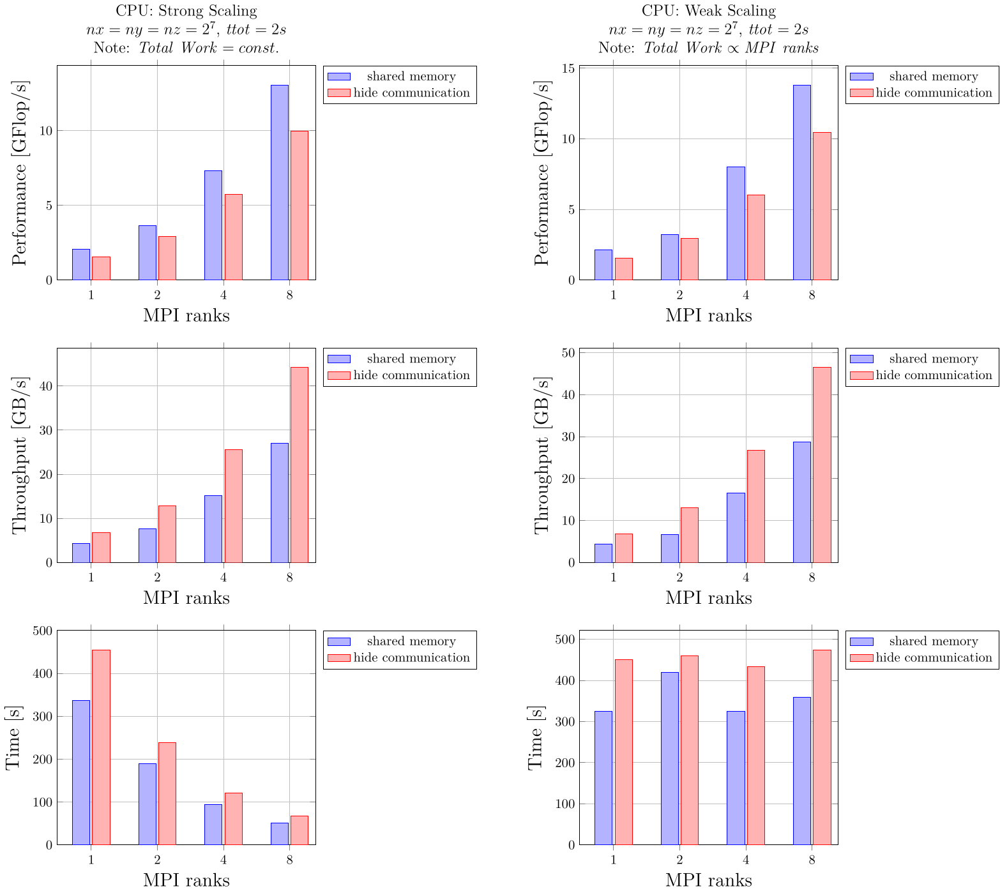

# Part 1: 3D multi-XPUs diffusion solver
Steady state solution of a diffusive process for given physical time steps using the pseudo-transient acceleration (using the so-called "dual-time" method).

💡 Use [ParallelStencil.jl](https://github.com/omlins/ParallelStencil.jl) and [ImplicitGlobalGrid.jl](https://github.com/eth-cscs/ImplicitGlobalGrid.jl) for the (multi-)XPU implementation. You are free to use either `@parallel` or `@parallel_indices` type of kernel definition.

## Intro
What's all about. Brief overview about:
- the process
- the equations
- the aims
- ...

<p align="center">
  
</p>

## Methods
The methods to be used:
- spatial and temporal discretisation
- solution approach
- hardware
- ...

## Results
Results section

### 3D diffusion
Report an animation of the 3D solution here and provide and concise description of the results. _Unleash your creativity to enhance the visual output._

<p align="center">
  
</p>

<p align="center">
  
</p>

<p align="center">
  
</p>

<p align="center">
  
</p>

<p align="center">
  
</p>

4 x NVIDIA GeForce GTX TITAN X

2 x Intel(R) Xeon(R) CPU E5-2620 v3 @ 2.40GHz (6 cores each)

```
ntselepidis@node15 ➜  ~ nvidia-smi topo -m
        GPU0    GPU1    GPU2    GPU3    mlx4_0  mlx4_1  CPU Affinity    NUMA Affinity
GPU0     X      PHB     SYS     SYS     PHB     SYS     0-5     0
GPU1    PHB      X      SYS     SYS     PHB     SYS     0-5     0
GPU2    SYS     SYS      X      PHB     SYS     PHB     6-11    1
GPU3    SYS     SYS     PHB      X      SYS     PHB     6-11    1
mlx4_0  PHB     PHB     SYS     SYS      X      SYS
mlx4_1  SYS     SYS     PHB     PHB     SYS      X

Legend:

  X    = Self
  SYS  = Connection traversing PCIe as well as the SMP interconnect between NUMA nodes (e.g., QPI/UPI)
  NODE = Connection traversing PCIe as well as the interconnect between PCIe Host Bridges within a NUMA node
  PHB  = Connection traversing PCIe as well as a PCIe Host Bridge (typically the CPU)
  PXB  = Connection traversing multiple PCIe bridges (without traversing the PCIe Host Bridge)
  PIX  = Connection traversing at most a single PCIe bridge
  NV#  = Connection traversing a bonded set of # NVLinks

```

### Performance
Briefly elaborate on performance measurement and assess whether you are compute or memory bound for the given physics on the targeted hardware.

#### Memory throughput
Strong-scaling on CPU and GPU -> optimal "local" problem sizes.

#### Weak scaling
Multi-GPU weak scaling

#### Work-precision diagrams
Provide a figure depicting convergence upon grid refinement; report the evolution of a value from the quantity you are diffusing for a specific location in the domain as function of numerical grid resolution. Potentially compare against analytical solution.

Provide a figure reporting on the solution behaviour as function of the solver's tolerance. Report the relative error versus a well-converged problem for various tolerance-levels. 

## Discussion
Discuss and conclude on your results

## References
Provide here refs if needed.
