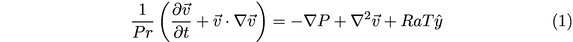
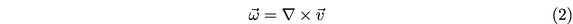
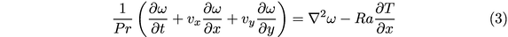
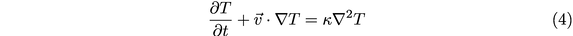
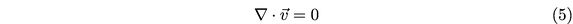
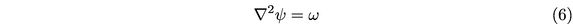
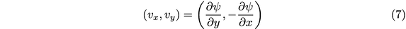
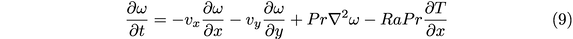

# Part 2: 2D XPU Navier-Stokes solver
Solving PDEs of your choice using Julia on (multi-) GPUs -or- applying some performance optimisation to an exisiting or "bake-off" problem.

## Intro
What's all about. Brief overview about:
- the process
- the equations
- the aims
- ...

### Reformulating the Navier-Stokes equations

Let T be the temperature, v the velocity, omega the vorticity, and psi the stream function.
Additionally, Pr denotes the Prandtl number, and Ra denotes the Rayleigh number.
Then we can establish the following equations:

**Conservation of momentum (dimensionless)**

  

Taking the curl of equation (1), and substituting the vorticity given below:

  

it follows that:

  

Note that in 2D only one component of vorticity is needed, i.e. the one perpendicular to the 2D plane.

**Conservation of mass (continuity)**

  

**Conservation of energy**

  

### Solving the Navier-Stokes equations

To solve the above equations, we follow the steps described below:

**Step 1:** Given omega solve for psi using a linear system solver.  In our case, we choose to use geometric Multigrid.

  

**Step 2:** Compute the velocity components v_x and v_y, as follows:

  

**Step 3:** Solve for temperature T using explicit or semi-implicit timestepping:

  

**Step 4:** Solve for vorticity omega using explicit or semi-implicit timestepping:

  

We note that all required matrix-vector products and linear system solves can be performed in a matrix-free way,
leading to a highly efficient and parallelizable implementation both for the CPU and for the GPU.

## Methods
The methods to be used:
- spatial and temporal discretisation
- solution approach
- hardware
- ...

## Results

### The physics you are resolving

### Performance

#### Memory throughput

#### Weak scaling

#### Work-precision diagrams

## Discussion

## References
