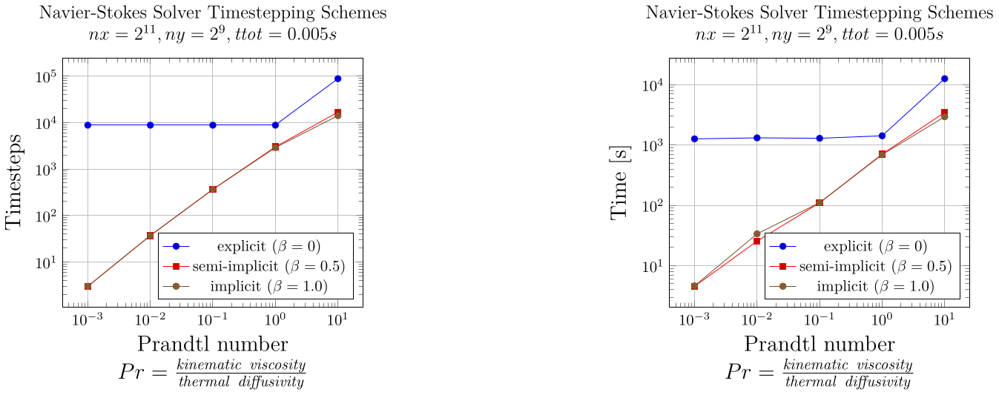

# Part 2: 2D XPU Navier-Stokes Solver

## Introduction

In part 2, we implement an XPU (i.e. CPU/GPU) solver for the incompressible Navier-Stokes equations in 2D.

We consider finite Prandtl number (i.e. ratio of kinematic viscosity over thermal diffusivity), allowing the simulation of almost any fluid.
Indicatively, we list a few cases of fluids along with the associated Prandtl numbers below:
- Liquid metals: 0.004 - 0.03
- Air: 0.7
- Water: 1.7 - 12
- Rock: ~10^24 (i.e. effectively infinite)

Our solver is based on the the streamfunction-vorticity formulation of the Navier-Stokes equations (as described in the following section), and allows both explicit and semi-implicit timestepping.
In explicit timestepping the timestep `dt` is computed as the minimum of the "diffusive" and the "advective" timestep, i.e. `dt = min(dt_dif, dt_adv)`.
Semi-implicit timestepping allows for large "diffusive" timesteps, i.e. `dt = dt_adv`, leading to smaller number of total timesteps towards a required time `ttot`, but requires the solution of linear systems for the update of the temperature and vorticity fields.
In every timestep of the Navier-Stokes simulation, we solve the required linear systems (one in the case of explicit and three in the case of semi-implicit timestepping) using a [geometric Multigrid method](https://en.wikipedia.org/wiki/Multigrid_method).
In Multigrid, we use damped Jacobi as smoother, and Jacobi or unpreconditioned conjugate gradient as solver for the coarsest grid.
Our implementation is completely matrix-free, and thus highly efficient and parallelizable for both CPU and GPU.

### Reformulating the Navier-Stokes equations as required by the Streamfunction-Vorticity method

Let T be the temperature, v the velocity, omega the vorticity, and psi the streamfunction.
Additionally, Pr denotes the Prandtl number, and Ra denotes the Rayleigh number.
Then we can establish the non-dimensionalized Finite-Prandtl Navier-Stokes equations in 2D, as shown below:

**Conservation of momentum (dimensionless)**

  

Taking the curl of equation (1), and substituting the vorticity given below:

  

it follows that:

  

Note that in 2D only one component of vorticity is needed, i.e. the one perpendicular to the 2D plane.

**Conservation of mass (dimensionless)**

  

**Conservation of energy**

  

## Method

### Solving the Navier-Stokes equations

To solve the above equations, we follow the steps described below:

**Step 1:** Given the vorticity omega solve for the streamfunction psi using a linear system solver. In our case, we choose to use geometric Multigrid.

  

**Step 2:** From the streamfunction, compute the velocity components v_x and v_y, as follows:

  

**Step 3:** Solve for temperature T using explicit or semi-implicit timestepping:

  

**Step 4:** Solve for vorticity omega using explicit or semi-implicit timestepping:

  

We note that all required matrix-vector products and linear system solves can be performed in a matrix-free way,
leading to a highly efficient and parallelizable implementation both for the CPU and for the GPU.

### Discretization

The spatial derivatives are discretized as follows:
- The diffusion term is approximated using second-order finite differences.
- The advection terms are approximated using first-order finite differences with upwinding.
- The remaining first-order derivatives are approximated using central differences.

Next we describe the discretization in time.

To keep notation simpler, let us assume that we solve a diffusion problem.

Then, semi-implicit timestepping would be described as follows:

  

In order to have a single equation for explicit, semi-implicit, and implicit timestepping, we can re-write equation (10) more generally as follows:

  

where `beta = 0` leads to explicit timestepping, `beta = 0.5` leads to semi-implicit timestepping, and `beta = 1.0` leads to implicit timestepping.

Based on the above, equations (8) and (9) for updating temperature T and vorticity omega, respectively, can be reformulated as shown below:

  

  

### Domain Shape, Boundary Conditions, and Initial Conditions

In our code we consider a rectangular domain with the following boundary conditions for the temperature T:
- **Top edge:**    Dirichlet BC T = 0 (low temperature).
- **Bottom edge:** Dirichlet BC T = 1 (high temperature).
- **Left edge:**   Neumann BC for T.
- **Right edge:**  Neumann BC for T.

For vorticity and streamfunction we assume Dirichlet boundary conditions equal to zero in all edges.

In the following results, we initialize temperature T with a cosine function, and vorticity omega as random.

## Results

### Hardware

We conducted all numerical experiments on a single compute node of octopus.

Such a node has 2 `Intel(R) Xeon(R) CPU E5-2620 v3 @ 2.40GHz` (6 cores each) and 4 `NVIDIA GeForce GTX TITAN X` GPUs.

Our code is using the `@parallel_indices` type of kernel definition from [ParallelStencil.jl](https://github.com/omlins/ParallelStencil.jl), and thus, it can run on a single multi-core CPU (with multi-threading, setting `JULIA_NUM_THREADS`) or on a single GPU.

### Example Simulation

Below we show the results of an example simulation, i.e. the evolution of temperature T, streamfunction S, and vorticity omega for ttot = 0.1.

  

### Benchmarking Multigrid

The following figures present the runtime (in seconds) of geometric Multigrid when solving a linear system with `( n_x * n_y )` degrees-of-freedom (dofs), where `n_x = n_y = 2^k + 1`, with `k` increasing, on a single CPU (single core, left) and on a single GPU (right).
In the same plots we vary the dofs of the coarsest linear system of Multigrid, i.e. `m_x * m_y`, where `m_x = m_y = 2^l + 1`, to investigate the effect of the coarsest solve size (or equivalently the depth of the recursion) to the total runtime (see lines with different colors).
Moreover, in each of these runs we use either Jacobi (see circles) or unpreconditioned conjugate gradient (see triangles) as solver in the coarsest grid, to assess when it is beneficial to use which solver.
We also note that in the case of the GPU we optimized all of our kernels to use shared memory.

  

**Comments**
- The order of the linear systems we solve with Multigrid in this experiment varies from `(2^4+1)*(2^4+1) = 17*17 = 289` to `(2^13+1)*(2^13+1) = 67'125'249`.
- The order of the coarsest linear systems we solve with Jacobi or unpreconditioned conjugate gradient in this experiment varies from `(2^2+1)*(2^2+1) = 25` to `(2^9+1)*(2^9+1) = 263'169`.
- Linear systems of order less than `(2^9+1)*(2^9+1) = 263'169` are faster to solve on the **CPU** using Multigrid.
- Linear systems of order greater than `(2^9+1)*(2^9+1) = 263'169` are faster to solve on the **GPU** using Multigrid.
- Using unpreconditioned conjugate gradient instead of Jacobi for the coarsest solve usually accelerates Multigrid. However, the gap between the two methods shrinks as the order of the coarsest problem gets smaller.
- Going down to the smallest coarsest problem (in our case `25*25`) seems to work best for Multigrid, both for the CPU and for the GPU.
- When solving very large linear systems, and also going down to very small coarsest solves, there is no big difference between the two coarse solvers since the runtime is dominated by the computations on the finer grids.
- The iteration count of Multigrid is constant for linear systems of a certain structure (in our case Poisson-like) given a prescribed tolerance, and thus Multigrid is exhibits great **numerical weak scalability**.
- The runtime of Multigrid on the GPU is only slightly increasing when increasing the problem size being solved.
- In addition, when running the same experiments on an `NVIDIA V100 GPU`, we saw that the upward curve that can be observed for large sizes in the right plot (i.e. GPU case) is not yet notable.

### Comparing different timestepping schemes

The following figures illustrate the number of timesteps and the associated runtime on the **GPU** of our Navier-Stokes simulation code, for `nx = 2^11 + 1`, `ny = 2^9 + 1`, and `ttot = 0.005s`, for increasing Prandtl number, when using explicit, semi-implicit, and implicit diffusion in the updates of temperature and vorticity.
We tuned Multigrid based on the plots shown in the previous section, so that it goes down to coarsest linear solves of order `25`, and using damped Jacobi as smoother as well as coarse solver.

  

We observe that using semi-implicit or implicit diffusion leads to much fewer timesteps and much smaller runtimes compared to pure explicit timestepping.
However, as the Prandtl number gets larger, the advantage of using semi-implicit or implicit over explicit timestepping gradually fades.
Moreover, in this experiment we can see that there is no difference in performance between implicit and semi-implicit (diffusion) timestepping.

